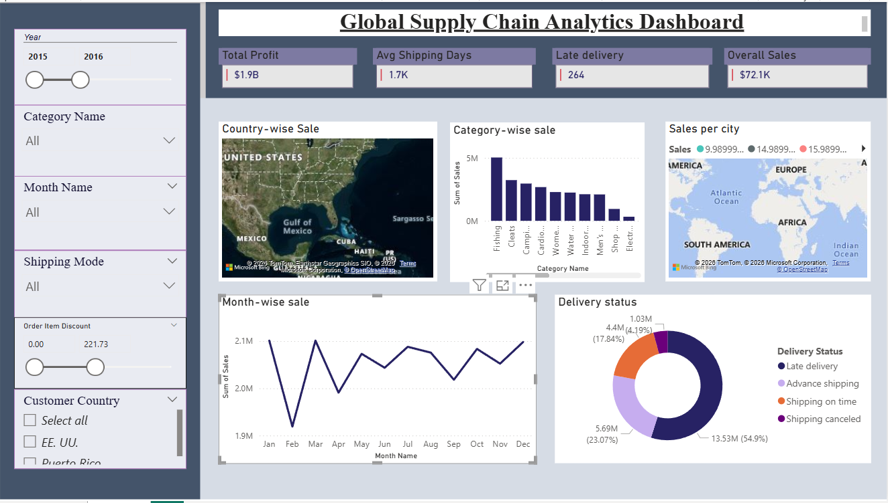

# Supply Chain Analytics Dashboard using Power BI

## Project Overview
This project presents an interactive Supply Chain Analytics Dashboard built using Power BI and the DataCo Supply Chain dataset. The dashboard provides insights into sales performance, shipment delays, regional trends, customer behavior, and operational efficiency.

The objective of this project is to transform raw supply chain data into actionable business intelligence insights using interactive visualizations and KPI-driven reporting.

---

## Key Features

- Revenue and profit analysis
- Shipment delay tracking
- Regional sales performance insights
- Product category analysis
- Customer segmentation analysis
- Interactive slicers and drill-down reports
- KPI cards for business monitoring
- Delivery risk and operational trend analysis

---

## Technologies Used

- Power BI
- DAX
- Power Query
- Data Visualization
- Business Intelligence Reporting

---

## Dashboard Screenshots

### Supply Chain Dashboard Overview

### Sales & Delivery Performance Analysis

### Regional Performance & Customer Insights

### Interactive KPI & Operational Dashboard

---

## Dataset

Data Source: DataCo Supply Chain Dataset

---

## Author

Ruchi Shukla
